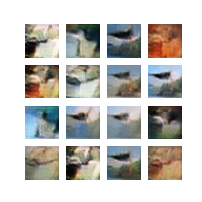

# cifar wgan
This repo contains a trained example for generating cifar using wasserstien gan architecture. Though model is trained until 2500 epochs in order to improve its kernel density you can train the model for couple of more iterations. The project is just here to provide you a kickstart on how to generate RGB channel images using GANs architectures.

More information about it could be found on [link](https://arxiv.org/abs/1701.07875)



### requirements
- tensorflow >= 2.0
- pillow
- matplotlib

### Preparing virtual env
If you dont have venv installed in your system you can do it by using
```
sudo apt install python3-venv
```
Now create virtual enviornment for your application
```
python -m venv env
```

Activating the venv
- Ubuntu/Linux
```
source env/bin/activate
```

- Windows
```
.\env\Scripts\activate
```

### Downloading the dataset
```python
(X_train, _), (x_test, _) = tf.keras.datasets.cifar10.load_data()

train_dataset = tf.data.Dataset.from_tensor_slices((tf.cast(X_train, tf.float32))).map(lambda x: (x-127.5)/127.5).shuffle(50000).batch(256)
```

### How to train model
```
python3 main.py
```

### How to Generate Images?
Image generation can be carried out using two different methods, which are as follows:

#### Using shell
```bash
python -i generate_images.py

image_generator = CifarImagesGenerator()
image_generator.generate_images()
```

#### In a python file
```python
from generate_images import CifarImagesGenerator

image_generator = CifarImagesGenerator()
image_generator.generate_images()
```
